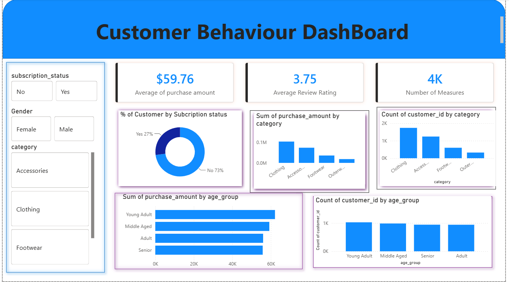

# 🛍️ Customer Shopping Behavior Analysis & BI Dashboard

An end-to-end consumer behavior analytics project analyzing **3,900+ retail transactions** to uncover demographic purchasing drivers, subscription adoption, product category performance, and customer satisfaction metrics.

---

## 🖥️ Executive Dashboard Preview



---

## 🎯 Business Objectives

* **Demographic Segmentation:** Analyze how customer age groups (`Young Adult`, `Middle Aged`, `Adult`, `Senior`) and genders influence spending patterns.
* **Subscription Viability:** Determine the revenue contribution and adoption rate of subscription memberships.
* **Category Contribution:** Identify high-volume vs. high-revenue merchandise categories (`Clothing`, `Accessories`, `Footwear`, `Outerwear`).
* **Satisfaction Tracking:** Monitor customer feedback across product tiers using average review ratings.

---

## 📈 Key Performance Indicators (KPIs)

| Metric | Value | Business Takeaway |
| :--- | :--- | :--- |
| **Total Analyzed Cohort** | **3,900 Customers** | Comprehensive retail shopper sample |
| **Average Purchase Amount** | **$59.76** | Consistent basket value across order cycles |
| **Average Review Rating** | **3.75 / 5.0** | Stable overall baseline with targeted room for category uplift |
| **Subscription Share** | **27% Subscribed / 73% Non-Subscribed** | Significant retention and conversion opportunity |

---

## 💡 Key Business Insights

* **Category Dominance:**
  * **Clothing** generates the largest share of revenue (~$104K) and customer orders (~1,700 items), followed closely by **Accessories** (~$74K).
  * **Outerwear** and **Footwear** represent lower transaction counts, indicating targeted niche demand rather than mass daily volume.
* **Age Group Spending Consistency:**
  * **Young Adults** lead overall spending (~$62K total purchase volume), followed by **Middle Aged** shoppers (~$59K).
  * Customer counts remain remarkably balanced across all four demographic tiers (~1,000 shoppers per age group), demonstrating broad cross-generational brand appeal.
* **Subscription Revenue Potential:**
  * With **73%** of shoppers currently non-subscribers, introducing member-exclusive incentives (e.g., free shipping, loyalty rewards) provides a clear lever to drive repeat visits and lift customer lifetime value (LTV).

---

## 🛠️ Tech Stack & Workflow

* **Python (Pandas, NumPy, Seaborn):** Initial data cleaning, schema validation, outlier detection, and statistical distribution checks.
* **Power BI Desktop:** Star-schema modeling, DAX aggregations (Average Order Value, Rating benchmarks, Category percentages).
* **Interactive Dashboard UX:** Built with dynamic slicers for instant slicing by `Subscription Status`, `Gender`, and `Product Category`.

---

## 📂 Repository Structure

```text
├── customer_behaviour_dashboard.png       # Dashboard screenshot preview
├── customer_shopping_trends.csv          # Raw customer retail dataset
├── Customer_Behavior_Analysis.ipynb      # Python data wrangling & EDA notebook
├── Customer_Behavior_Dashboard.pbix      # Power BI interactive file
└── README.md                             # Project overview and key findings
